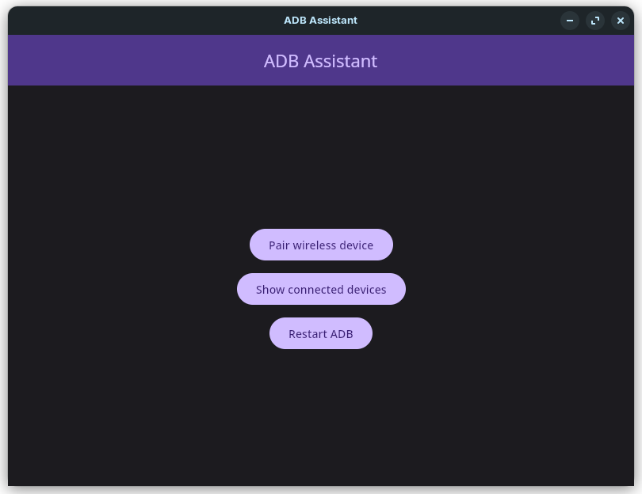

# ADB Assistant

A GUI for common ADB commands written with Compose Multiplatform.

## Download
You can download latest version from [releases tab](https://github.com/AlirezaIvaz/ADBAssistant/releases).

## Requirements
- **ADB** in `$PATH`

## Supported commands
At this time, these commands are supported:

- **Pair wireless devices** (only _Android 11_ and higher)
- **Connect** **to wireless devices**
- **Restart ADB server**

## License

    Copyright 2024 Alireza Ivaz

    Licensed under the Apache License, Version 2.0 (the "License");
    you may not use this file except in compliance with the License.
    You may obtain a copy of the License at

       http://www.apache.org/licenses/LICENSE-2.0

    Unless required by applicable law or agreed to in writing, software
    distributed under the License is distributed on an "AS IS" BASIS,
    WITHOUT WARRANTIES OR CONDITIONS OF ANY KIND, either express or implied.
    See the License for the specific language governing permissions and
    limitations under the License.
